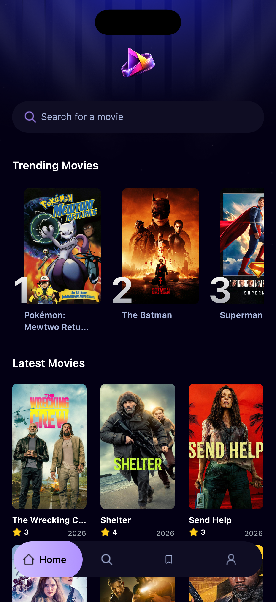
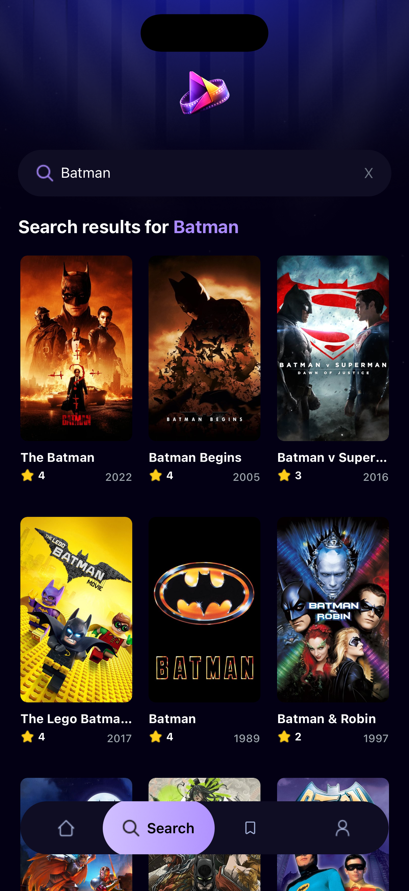
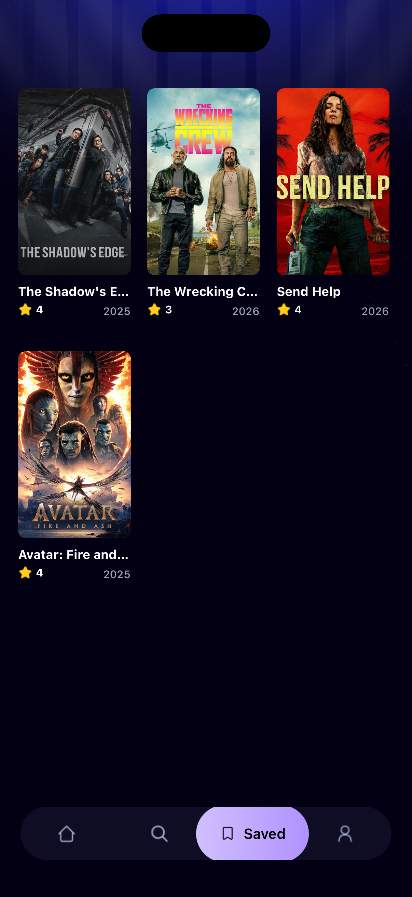

# 🎬 Movix

**Movix** is a polished **mobile movie discovery app** built with **Expo & React Native**.  
It focuses on clean UI, smooth UX, and real-world features like authentication, favorites, and localization.

This project was built as a **portfolio application**, showcasing modern mobile development patterns and production‑ready architecture.

---

## ✨ Highlights

- 🎥 Browse **trending** and **latest** movies
- 🔍 Real-time **search**
- ❤️ Save & manage **bookmarked movies**
- 🔐 **Google OAuth** authentication (Appwrite)
- 🌍 **Multi-language support** (auto-detects device language)
- 📱 Bottom tab navigation with smooth transitions
- 🎨 Modern dark UI with NativeWind (Tailwind for RN)
- ⚡ Global state via React Context & hooks

---

## 📸 Screenshots

| Home                      |
|---------------------------|
|  |

| Search                      | Saved                      | Profile                      |
|-----------------------------|----------------------------|------------------------------|
|  |  |  |


> Screenshots taken from iOS simulator (iPhone 17 Pro)

---

## 🛠️ Tech Stack

- **Expo**
- **React Native**
- **TypeScript**
- **Expo Router**
- **NativeWind**
- **Appwrite** (Auth & Database)

---

## 🚀 Getting Started

Clone the repository:

```bash
git clone https://github.com/gastoncuesta/movix.git
cd movix
```

Install dependencies:

```bash
npm install
```

Run the app:

```bash
npx expo start
```

---

## ⚙️ Environment Variables

Create a `.env` file in the project root:

```env
APPWRITE_ENDPOINT=https://your-appwrite-endpoint
APPWRITE_PROJECT_ID=your_project_id
```

(Optional) Add your movie API key if required.

---

## 📁 Project Structure

```text
movix/
├── app/            # Screens & routing
├── components/     # Reusable UI components
├── services/       # Appwrite & API logic
├── constants/      # Icons, images, config
├── assets/         # Static assets
├── screenshots/    # App screenshots (for README)
├── app.json
└── README.md
```

---

## 📱 Usage

1. Launch the app via Expo Go or emulator  
2. Sign in with Google  
3. Discover and search movies  
4. Bookmark your favorites  
5. Switch language from the profile screen  

---

## 🎯 Purpose

This project was created to demonstrate:

- Real authentication flows
- Persistent user data
- Clean UI/UX for consumer apps
- Scalable folder structure
- Cross-platform mobile development

---

## 📜 License

MIT License © Gastón Cuesta
